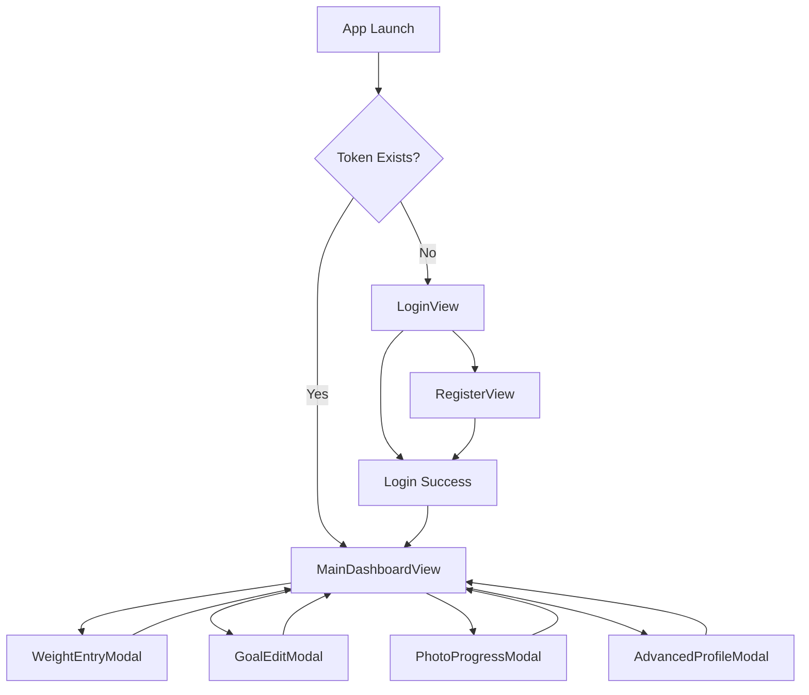

# Design Document

## Overview

PesoTracker es una aplicación nativa para macOS desarrollada con SwiftUI que implementa el patrón arquitectónico MVVM (Model-View-ViewModel). La aplicación permite a los usuarios rastrear su peso corporal, establecer metas, visualizar progreso fotográfico y obtener predicciones inteligentes sobre el logro de objetivos.

La aplicación se estructura en torno a un dashboard principal con layout dividido (35/65) que proporciona una vista completa del progreso del usuario, complementado con modales especializados para entrada de datos y configuración avanzada.

## Architecture

### Patrón MVVM

**Models**: Estructuras Swift que representan los datos de la API
- `User`: Información del usuario autenticado
- `Weight`: Registros de peso con fecha, notas y foto opcional
- `Goal`: Metas principales y milestones
- `Photo`: Metadatos de imágenes de progreso
- `UserProfile`: Configuración avanzada (altura, edad, estilo de vida)

**Views**: Componentes SwiftUI que observan ViewModels
- Views de autenticación (Login/Register)
- Dashboard principal con paneles divididos
- Modales para entrada de datos
- Componentes reutilizables

**ViewModels**: Clases ObservableObject que manejan estado y lógica de negocio
- `AuthViewModel`: Gestión de autenticación y tokens
- `DashboardViewModel`: Coordinación de datos del dashboard
- `WeightViewModel`: CRUD de registros de peso
- `GoalViewModel`: Gestión de metas y milestones
- `PhotoViewModel`: Manejo de imágenes de progreso

### Estructura de Directorios

```
PesoTracker/
├── App/
│   ├── PesoTrackerApp.swift (punto de entrada)
│   └── ContentView.swift (vista raíz)
├── Models/
│   ├── User.swift
│   ├── Weight.swift
│   ├── Goal.swift
│   ├── Photo.swift
│   └── UserProfile.swift
├── ViewModels/
│   ├── AuthViewModel.swift
│   ├── DashboardViewModel.swift
│   ├── WeightViewModel.swift
│   ├── GoalViewModel.swift
│   ├── PhotoViewModel.swift
│   └── ProfileViewModel.swift
├── Views/
│   ├── Auth/
│   │   ├── LoginView.swift
│   │   └── RegisterView.swift
│   ├── Dashboard/
│   │   ├── MainDashboardView.swift
│   │   ├── SummaryPanelView.swift
│   │   ├── DataPanelView.swift
│   │   └── WeightChartView.swift
│   ├── Modals/
│   │   ├── WeightEntryModal.swift
│   │   ├── GoalEditModal.swift
│   │   ├── PhotoProgressModal.swift
│   │   └── AdvancedProfileModal.swift
│   └── Components/
│       ├── GoalCard.swift
│       ├── MilestoneCard.swift
│       ├── WeightRowView.swift
│       └── PhotoCarousel.swift
├── Services/
│   ├── APIService.swift
│   ├── AuthService.swift
│   ├── WeightService.swift
│   ├── GoalService.swift
│   └── PhotoService.swift
└── Utils/
    ├── Extensions.swift
    ├── ColorScheme.swift
    ├── PredictionEngine.swift
    └── Constants.swift
```

### Flujo de Navegación



## Components and Interfaces

### Core Views

#### MainDashboardView
- **Layout**: HStack con proporción 35/65
- **Panel Izquierdo**: SummaryPanelView (resumen, metas, acciones)
- **Panel Derecho**: DataPanelView (gráfico, tabla de pesos)
- **Estado**: Observa DashboardViewModel para datos centralizados

#### SummaryPanelView
- **Resumen Personal**: Peso inicial, actual, pérdida total, promedio semanal
- **Meta Principal**: GoalCard con progreso y predicción
- **Milestone Activo**: MilestoneCard con progreso específico
- **Predicción Avanzada**: Información de IMC y predicción IA (opcional)
- **Botones de Acción**: Nueva meta, milestone, progreso fotográfico, logout

#### DataPanelView
- **Gráfico de Progreso**: WeightChartView con líneas de datos reales y predicción
- **Tabla de Pesos**: Lista de WeightRowView con acciones de editar/eliminar
- **Botón Agregar**: Acción principal para nuevo registro de peso

### Modals

#### WeightEntryModal
- **Campos**: Peso (requerido), fecha, notas opcionales
- **Foto**: PhotoUploadView para selección de imagen
- **Validación**: Peso debe ser número positivo
- **Acciones**: Cancelar, Guardar

#### GoalEditModal
- **Tipos**: Meta principal o milestone
- **Campos**: Peso objetivo, fecha objetivo
- **Sugerencias**: Para milestones, sugerencia automática del 25% del progreso
- **Validación**: Peso objetivo debe ser diferente al actual

#### PhotoProgressModal
- **Carrusel**: Navegación entre fotos con botones anterior/siguiente
- **Información**: Peso, fecha, notas de cada registro
- **Indicadores**: Puntos de progreso para mostrar posición actual
- **Controles**: Navegación habilitada/deshabilitada según disponibilidad

#### AdvancedProfileModal
- **Campos**: Altura, edad, sexo, estilo de vida
- **Cálculo IMC**: Automático basado en altura y peso actual
- **Categorización**: Normal, Sobrepeso, etc.
- **Predicción Mejorada**: Usa datos del perfil para cálculos más precisos

### Componentes Reutilizables

#### GoalCard
- **Información**: Peso objetivo, fecha original, predicción actual
- **Progreso**: Barra de progreso visual
- **Colores**: Dinámicos según tendencia (verde/amarillo/rojo)
- **Acciones**: Editar, eliminar

#### MilestoneCard
- **Información**: Peso objetivo, fecha, progreso restante
- **Estado**: Solo un milestone activo por vez
- **Acciones**: Editar, marcar como completado

#### WeightRowView
- **Datos**: Fecha, peso, indicador de foto, notas
- **Acciones**: Editar, eliminar
- **Formato**: Tabla con columnas alineadas

## Data Models

### User Model
```swift
struct User: Codable, Identifiable {
    let id: String
    let username: String
    let email: String
    let createdAt: Date
}
```

### Weight Model
```swift
struct Weight: Codable, Identifiable {
    let id: String
    let weight: Double
    let date: Date
    let notes: String?
    let photoURL: String?
    let userId: String
}
```

### Goal Model
```swift
struct Goal: Codable, Identifiable {
    let id: String
    let targetWeight: Double
    let targetDate: Date
    let type: GoalType // main, milestone
    let parentGoalId: String?
    let milestoneNumber: Int?
    let isCompleted: Bool
    let userId: String
}

enum GoalType: String, Codable {
    case main
    case milestone
}
```

### Photo Model
```swift
struct Photo: Codable, Identifiable {
    let id: String
    let weightId: String
    let photoURL: String
    let notes: String?
    let uploadedAt: Date
}
```

### UserProfile Model
```swift
struct UserProfile: Codable {
    let userId: String
    let height: Double? // cm
    let age: Int?
    let gender: Gender?
    let lifestyle: Lifestyle?
    let updatedAt: Date
}

enum Gender: String, Codable, CaseIterable {
    case male = "male"
    case female = "female"
}

enum Lifestyle: String, Codable, CaseIterable {
    case sedentary = "sedentary"
    case active = "active"
    case veryActive = "very_active"
}
```

## Error Handling

### Error Types
```swift
enum AppError: Error, LocalizedError {
    case networkError(String)
    case authenticationFailed
    case invalidData
    case validationError(String)
    case serverError(Int)
    
    var errorDescription: String? {
        switch self {
        case .networkError(let message):
            return "Error de conexión: \(message)"
        case .authenticationFailed:
            return "Credenciales inválidas"
        case .invalidData:
            return "Datos inválidos"
        case .validationError(let message):
            return message
        case .serverError(let code):
            return "Error del servidor (\(code))"
        }
    }
}
```

### Error Handling Strategy
- **ViewModels**: Capturan errores y los exponen como @Published properties
- **Views**: Observan errorMessage y muestran alerts o banners
- **Network Layer**: Maneja errores HTTP y de conectividad
- **Validation**: Errores de validación mostrados en tiempo real

### Loading States
- **Global Loading**: Para operaciones que bloquean toda la UI
- **Local Loading**: Para operaciones específicas (botones, listas)
- **Skeleton Loading**: Para contenido que se está cargando

## Testing Strategy

### Unit Testing
- **Models**: Validación de codificación/decodificación JSON
- **ViewModels**: Lógica de negocio y manejo de estado
- **Services**: Llamadas a API y manejo de respuestas
- **Utils**: PredictionEngine y cálculos matemáticos

### Integration Testing
- **API Integration**: Pruebas con mock server
- **Authentication Flow**: Login/register/logout completo
- **Data Persistence**: Keychain y UserDefaults

### UI Testing
- **Navigation Flow**: Flujo completo de usuario
- **Modal Interactions**: Apertura, cierre, validación
- **Form Validation**: Campos requeridos y formatos

### Testing Tools
- **XCTest**: Framework principal de testing
- **Mock Services**: Para simular respuestas de API
- **UI Testing**: Para flujos de usuario end-to-end

## Visual Design System

### Color Scheme
```swift
enum WeightTrend {
    case losing    // Verde (.systemGreen)
    case gaining   // Rojo (.systemRed)
    case stable    // Amarillo (.systemYellow)
}

// Colores adaptativos para modo oscuro
extension Color {
    static let primaryBackground = Color(.systemBackground)
    static let secondaryBackground = Color(.secondarySystemBackground)
    static let primaryText = Color(.label)
    static let secondaryText = Color(.secondaryLabel)
}
```

### Typography
- **Títulos**: .title, .title2 con .bold()
- **Cuerpo**: .body para texto general
- **Captions**: .caption para información secundaria
- **Números**: .monospacedDigit para consistencia en tablas

### Iconography (SF Symbols)
- **Meta principal**: "target"
- **Milestone**: "mappin.circle"
- **Fotos**: "camera.fill"
- **Editar**: "pencil"
- **Eliminar**: "trash"
- **Configuración**: "gearshape"
- **Agregar**: "plus.circle.fill"

### Layout Guidelines
- **Spacing**: Múltiplos de 8pt (8, 16, 24, 32)
- **Padding**: 16pt para contenedores, 8pt para elementos internos
- **Corner Radius**: 8pt para cards, 4pt para botones
- **Shadows**: Sutiles para elevación de modals

## Performance Considerations

### Data Loading
- **Lazy Loading**: Para listas grandes de pesos y fotos
- **Pagination**: API endpoints con limit/offset
- **Caching**: Imágenes y datos frecuentemente accedidos

### Memory Management
- **Weak References**: En closures y delegates
- **Image Optimization**: Redimensionamiento automático
- **Background Processing**: Para cálculos pesados

### Network Optimization
- **Request Batching**: Combinar múltiples operaciones
- **Retry Logic**: Para fallos de red temporales
- **Offline Support**: Cache local para funcionalidad básica

## Security Considerations

### Authentication
- **JWT Tokens**: Almacenados en Keychain
- **Token Refresh**: Automático antes de expiración
- **Secure Storage**: Datos sensibles en Keychain

### Data Validation
- **Input Sanitization**: En todos los formularios
- **Type Safety**: Uso de enums y structs tipados
- **API Validation**: Validación tanto client como server-side

### Privacy
- **Photo Permissions**: Solicitud explícita para acceso a fotos
- **Data Encryption**: En tránsito y en reposo
- **User Consent**: Para funcionalidades opcionales